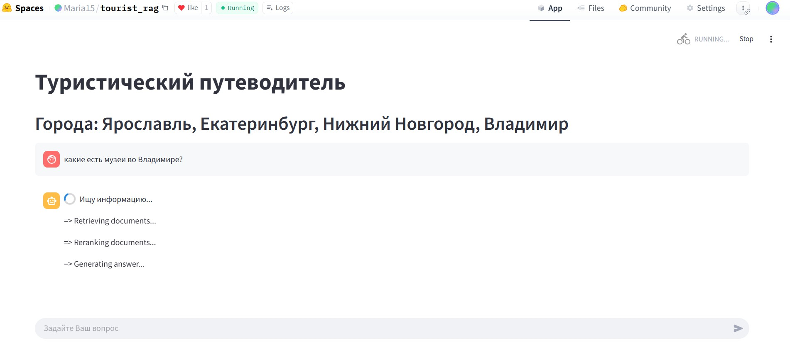
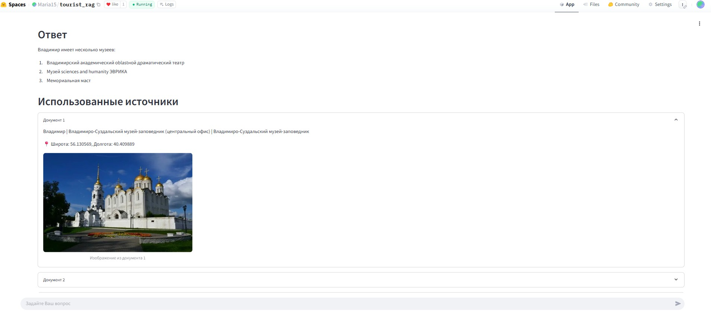
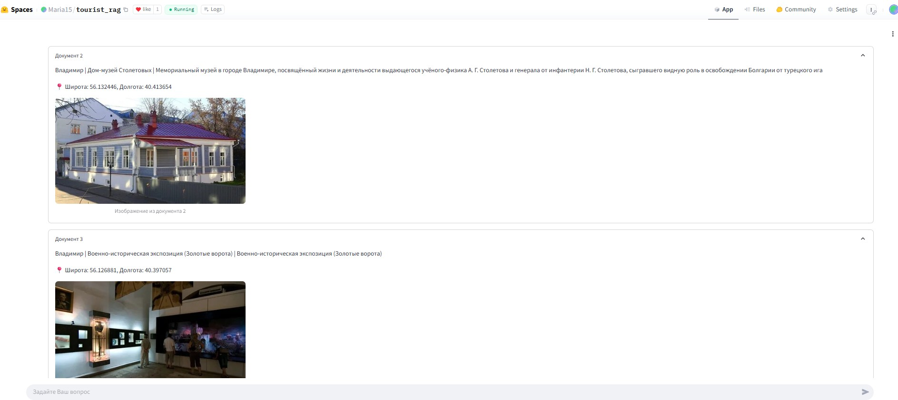
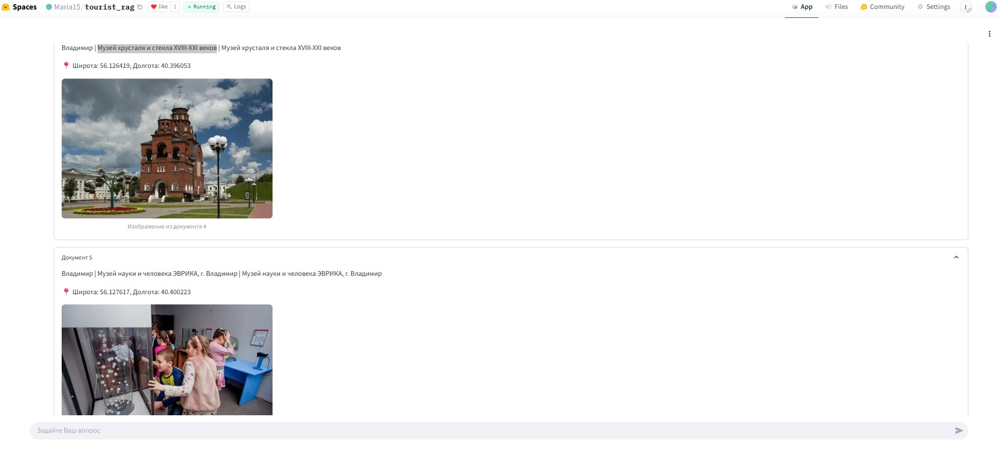

1. Проект по NLP - туристический RAG-путеводитель
2. Исполнитель проекта - Сучкова Мария
3. Описание: проект посвящен созданию туристического путеводителя по 4 городам России – Владимир, Ярославль, Екатеринбург и Нижний Новгород с помощью метода NLP, а именно подхода RAG.
4. Основной файл app.py для веб Streamlit приложения, которое размещено на сайте HuggingFace по ссылке https://huggingface.co/spaces/Maria15/tourist_rag  (на сайте запускается модель Vikhrmodels/Vikhr-Llama-3.2-1B-Instruct, это связано  с ограничением памяти -весит модель 3гб, приложение к сожалению долго грузится и отвечает, потому что на HF нет бесплатного использования видеокарт GPU)
5. Также файл rag_local.py для локального развертывания Streamlit приложения у себя на компьютере (локально запускается модель reader LLM Qwen2.5-3B-Instruct - весит около 8гб)
6. Файлы loader.py, reader_llm.py, reranker.py, retrieval.py, answer_rag.py - это все файлы реализации схемы RAG.
7. Данные для векторной базы FAISS: данные представляют из себя таблицу (combined_cities.csv с изображениями (600мб) и combinated_cities_light (18мб)- облегченная версия), в которой по столбцам содержится информация о памятниках, архитектуре и других значимых местах для 4 городов. В данных есть столбцы:
* Name - название достопримечательности;
* City - город расположения;
* Lon, Lat - координаты долготы и широты;
* description - описание (извлеченное из WikiData);
* image - изображение в формате base64;
8. Основной ноутбук Suchkova_project_rag.ipynb с исследованием и тестированием подхода RAG находится по ссылке на моем гугл-диске https://colab.research.google.com/drive/1ICNuyUY7Jat51qPI6F-64kIlrU9gU29N?usp=sharing
9. Краткое резюме исследования находится в файле Resume_project_RAG.pdf

Скриншоты приложения
- задаешь вопрос в специальное поле для этого;
- модель думает и выдает ответ словами, и в документах можно посмотреть сами достопримечательности, координаты и фотографии к ним.

